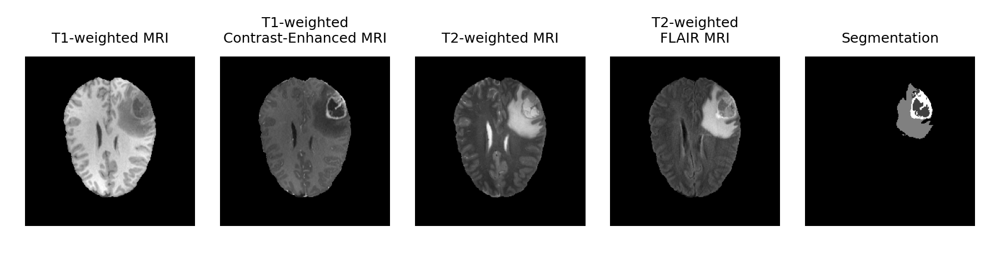
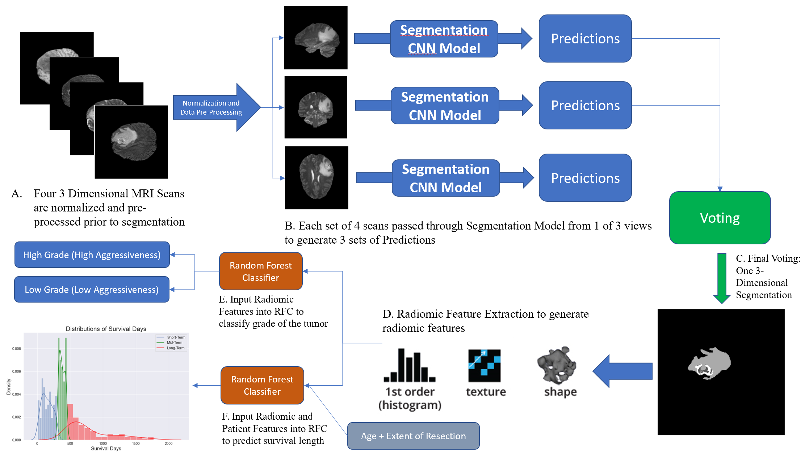
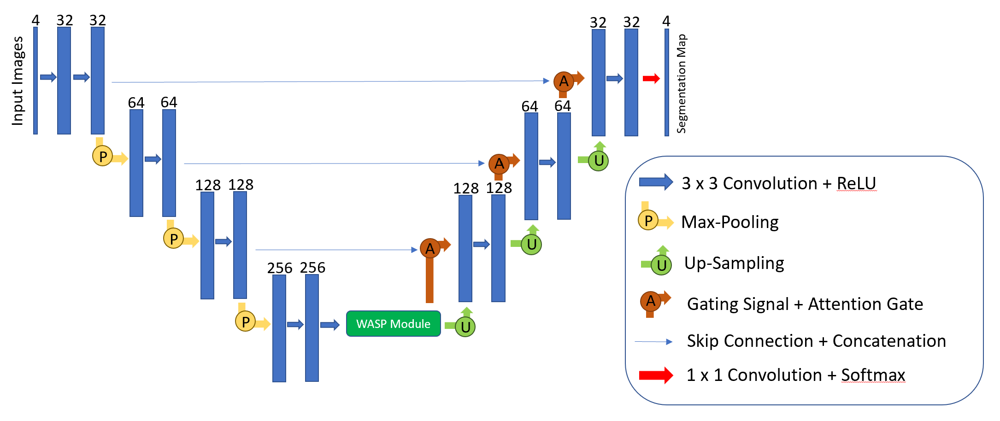
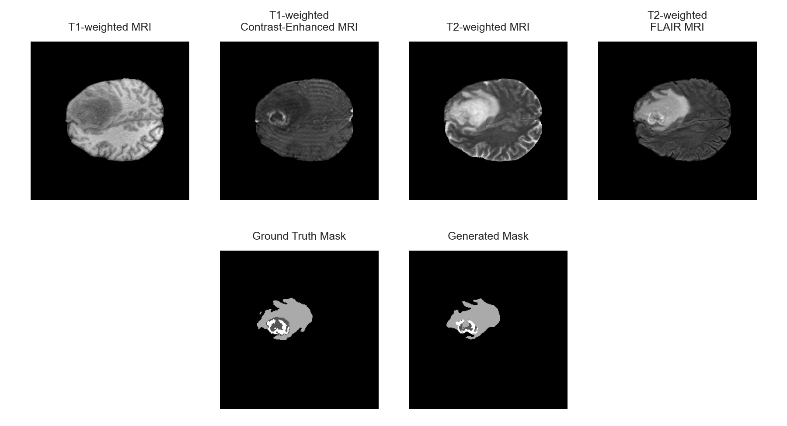
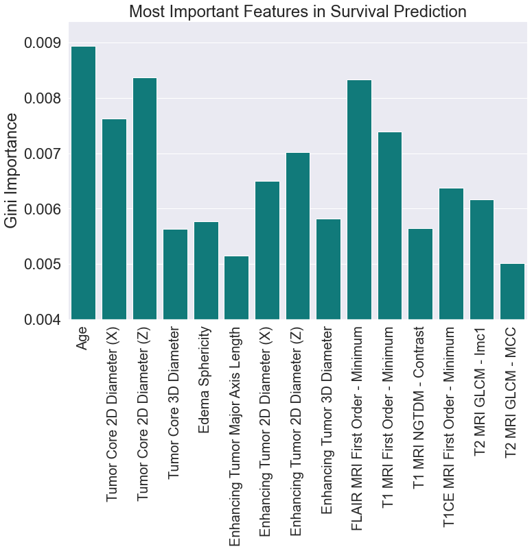
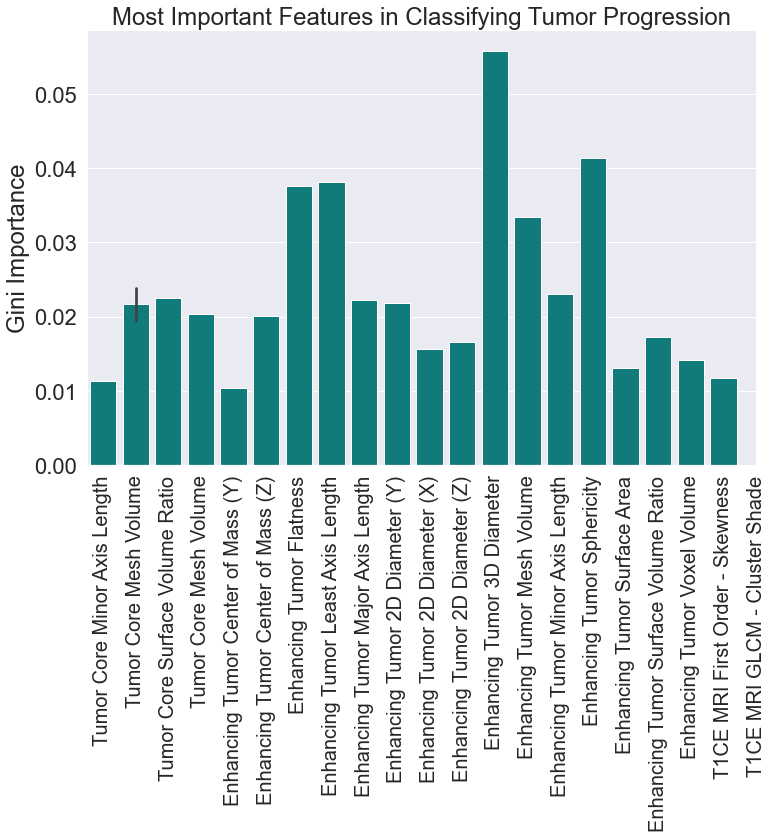

# A Deep Learning Framework for Automated Brain Tumor Segmentation and Survival Prediction using Multimodal MRI Scans

This work was completed as part of the Brain Tumor Segmentation (BraTS) Challenge 2020[1-5].

## Background
Gliomas are the most common and fatal type of brain tumors. Diagnosis and treatment planning for gliomas largely relies on manual interpretation of magnetic resonance images (MRIs) with can be inefficient and subjective and often leads to suboptimal treatment plans. 

Hence, the goal of this project was to design a comprehensive suite of algorithms using deep learning and other machine learning algorithms for the automated interpretation of multimodal MRI scans with 3 particular goals in mind:
1. Segmentation of the brain tumor
2. Classification of the tumor grade
3. Estimation of the length of patient survival

## Methodology
### Data
The dataset, provided as part of the BraTS Challenge 2020, included 4 sequences of MRIs for each patient (shown below).
1. T1-weighted
2. T1-weighted contrast-enhanced
3. T2-weighted
4. T2-weighted FLAIR

 Additionally, ground truth annotations of the tumor segmentation (subdivided into the necrotic tumor core, edema, and the enhancing tumor), tumor grade, and patient survival were provided.

### Methodology

 The complete proposed methodology for segmentation, tumor grade classification, and survival prediction is shown below:
 
 

### Segmentation

Segmentation is performed by ensembling several 2-dimensional convolutional neural networks. Each network is composed of a U-Net architecture[6], modified to include Waterfall Atrous Spatial Pooling[7] to enhance the ability of the network to incorporate contextual information as well as attention gates[8] to improve network's accuracy in predicting regions with small areas and large variability in shape. The proposed architecture of the network is shown below:

Three CNNs were trained to process the 4 MRI scans along the sagittal, coronal, and axial planes, and a voting algorithm was then used to obtain final segmentation predictions.

### Tumor Grade Classification and Survival Prediction

A radiomic feature extraction was used to extract 440 quantative features about tumor shape, texture, and heterogeneity from the scans and associated segmentation for each patient, which was joined with patient features such as age. A random forest classifier was then used to predict tumor grade and the length of survival (short, mid, or long-term) on the radiomic and patient features.

## Results

The segmentation model performed at a Dice similarity coefficient of 0.762, with a specificity of 0.734 and sensitivity of 0.989. A comparison of the model's prediction with the ground-truth annotation is shown below:

Tumor classification was performed at an accuracy of 94.6% and survival prediction at an accuracy of 61.7%. The following radiomic features were identified as particularly important for the these tasks:

  
   

## References

1. B. H. Menze, A. Jakab, S. Bauer, J. Kalpathy-Cramer, K. Farahani, J. Kirby, et al. "The Multimodal Brain Tumor Image Segmentation Benchmark (BRATS)", IEEE Transactions on Medical Imaging 34(10), 1993-2024 (2015) DOI: 10.1109/TMI.2014.2377694 (opens in a new window)
2. S. Bakas, H. Akbari, A. Sotiras, M. Bilello, M. Rozycki, J.S. Kirby, et al., "Advancing The Cancer Genome Atlas glioma MRI collections with expert segmentation labels and radiomic features", Nature Scientific Data, 4:170117 (2017) DOI: 10.1038/sdata.2017.117(opens in a new window)
3. S. Bakas, M. Reyes, A. Jakab, S. Bauer, M. Rempfler, A. Crimi, et al., "Identifying the Best Machine Learning Algorithms for Brain Tumor Segmentation, Progression Assessment, and Overall Survival Prediction in the BRATS Challenge", arXiv preprint arXiv:1811.02629 (2018)
4. S. Bakas, H. Akbari, A. Sotiras, M. Bilello, M. Rozycki, J. Kirby, et al., "Segmentation Labels and Radiomic Features for the Pre-operative Scans of the TCGA-GBM collection", The Cancer Imaging Archive, 2017. DOI: 10.7937/K9/TCIA.2017.KLXWJJ1Q(opens in a new window)
5. S. Bakas, H. Akbari, A. Sotiras, M. Bilello, M. Rozycki, J. Kirby, et al.,(opens in a new window) "Segmentation Labels and Radiomic Features for the Pre-operative Scans of the TCGA-LGG collection", The Cancer Imaging Archive, 2017. DOI: 10.7937/K9/TCIA.2017.GJQ7R0EF(opens in a new window)
6.	Ronneberger, Olaf, Philipp Fischer, and Thomas Brox. "U-net: Convolutional networks for biomedical image segmentation." International Conference on Medical image computing and computer-assisted intervention. Springer, Cham, 2015.
7. Artacho, B., & Savakis, A. (2019). Waterfall atrous spatial pooling architecture for efficient semantic segmentation. Sensors, 19(24), 5361.
8. Oktay, Ozan, et al. "Attention u-net: Learning where to look for the pancreas." arXiv preprint arXiv:1804.03999 (2018).
